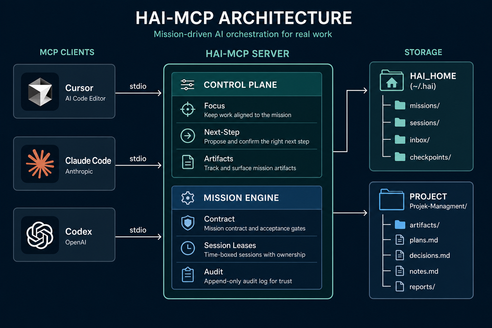
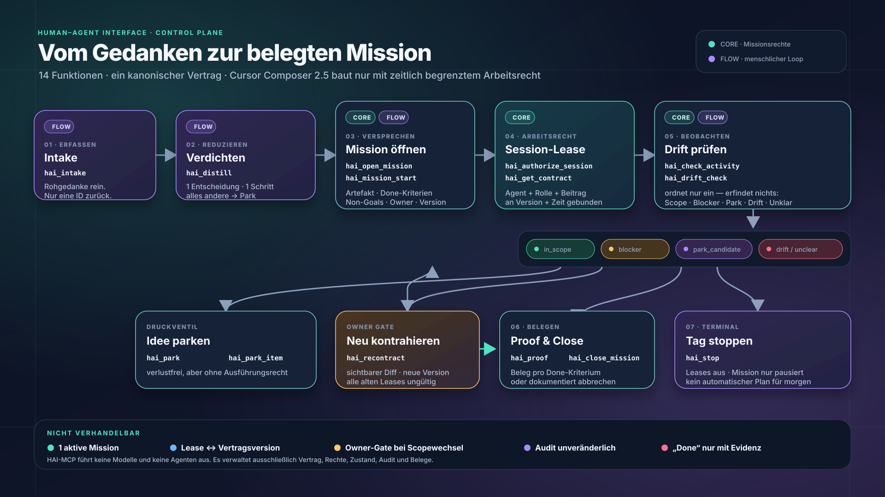
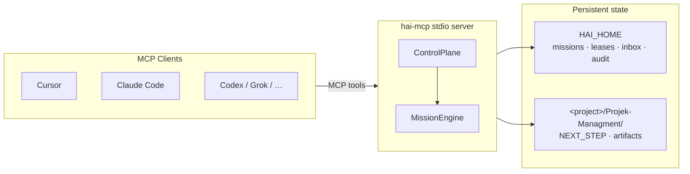

<div align="center">

# HAI-MCP

**Model-agnostic Human-Agent Interface control plane — as an MCP server.**

[](https://www.python.org/)
[](https://modelcontextprotocol.io/)
[](pyproject.toml)

Any MCP client (Cursor, Claude Code, Codex, Grok, OpenCode, Hermes, …) can call the same tools.
The server never calls an LLM.

</div>

<p align="center">
  
</p>

## Problem → Solution

Agents and coding assistants excel at execution, but they lack a shared, durable contract for **what** is in scope, **who** may act, and **when** work is actually done. Without a control plane, focus drifts, side ideas steal lanes, and “done” becomes a guess.

**HAI-MCP** is a small, deterministic MCP server that sits between your client and your projects. It manages focus lanes, run-contract artifacts, bounded missions with versioned contracts, time-limited session leases, and fail-closed owner gates — without embedding any model or agent runtime.

Clients call tools; the server enforces policy, writes auditable state, and returns structured JSON. Models stay on the client side where they belong.

## Features

- **Model-agnostic stdio MCP** — one binary, any host that speaks MCP
- **Project run contract** — canonical `NEXT_STEP.md`, proposals, and artifact summaries under `Projek-Managment/`
- **Focus & inbox** — max two active lanes, park thoughts without stealing focus
- **Mission lifecycle** — one active mission, versioned contracts, session leases, activity classification
- **Owner gates (fail-closed)** — promote next steps, recontract, or abandon only with `owner_ack=true` + reason
- **Daily flow tools** — intake → distill → mission start → drift check → proof → stop
- **Path confinement** — all writes resolved under `HAI_HOME` or the declared project root
- **No LLM inside the server** — zero model calls; pure control-plane logic

## Quick start

```bash
git clone https://github.com/smlfg/hai-mcp.git
cd hai-mcp
uv sync --all-extras
uv run hai-mcp
```

Point your MCP client at the server (adjust paths):

```json
{
  "mcpServers": {
    "hai": {
      "command": "uv",
      "args": ["run", "--directory", "/absolute/path/to/hai-mcp", "hai-mcp"],
      "env": {
        "HAI_HOME": "/home/you/.hai"
      }
    }
  }
}
```

Ready-made snippets: [`docs/client-snippets/`](docs/client-snippets/).

Verify after connect: `hai_health`, `hai_status`.

## Tools

Full gate matrix and error codes: [`docs/TOOL_CONTRACT.md`](docs/TOOL_CONTRACT.md).

### Control plane (project & focus)

| Tool | Role | Gate |
|------|------|------|
| `hai_health` | Server + `HAI_HOME` health; optional project path check | — |
| `hai_status` | Active lanes, focus, inbox count, next-step flags | — |
| `hai_get_next_step` | Read canonical `NEXT_STEP.md` | — |
| `hai_read_artifacts` | Read-only summary of run-contract artifacts | — |
| `hai_park` | Park a thought in inbox (no lane change) | — |
| `hai_set_focus` | Set/switch focus (max 2 ACTIVE lanes) | soft: max 2 |
| `hai_propose_next_step` | Write `NEXT_STEP.proposed.md` | — |
| `hai_accept_next_step` | Promote proposal → canonical `NEXT_STEP.md` | **owner_ack + reason** |
| `hai_checkpoint` | Snapshot context under `HAI_HOME/history/checkpoints` | — |
| `hai_recover` | Smallest recovery action from a checkpoint (advice only) | — |

### Mission engine (canonical lifecycle)

| Tool | Role | Gate |
|------|------|------|
| `hai_open_mission` | Open bounded mission + contract v1 | valid contract; one active mission |
| `hai_authorize_session` | Grant time-bounded session lease | active mission; contract version; capacity |
| `hai_get_contract` | Return exact canonical contract for a lease | valid non-expired lease |
| `hai_check_activity` | Classify activity vs contract (scope, drift, park, blocker) | valid session lease |
| `hai_park_item` | Park mission-linked idea with full context | rationale required |
| `hai_recontract` | Apply visible field-level contract diff | **owner_ack + reason** |
| `hai_close_mission` | Complete with evidence or abandon | completed: per-criterion evidence; abandoned: **owner_ack** |

### Daily flow (thin wrappers over the mission engine)

| Tool | Role |
|------|------|
| `hai_intake` | Capture raw thought immutably; returns intake id only |
| `hai_distill` | One decision + one next step; parks everything else |
| `hai_mission_start` | Fast start wrapper over `hai_open_mission` |
| `hai_drift_check` | Lightweight wrapper over `hai_check_activity` |
| `hai_proof` | Close mission with verified per-criterion evidence |
| `hai_stop` | Day terminal: record closure answers, revoke leases (missions not auto-closed) |

## Architecture

<p align="center">
  
</p>

*Lifecycle diagram (owner-facing labels in German). Tool names are canonical English.*



| Layer | Responsibility |
|-------|----------------|
| **FastMCP stdio** | Tool registration, JSON responses, no network listener |
| **ControlPlane** | Focus lanes, artifacts, inbox, checkpoints, intake/distill/stop |
| **MissionEngine** | Contracts, leases, activity classification, parking, audit trail |
| **Path confinement** | Symlink-safe resolution; writes never escape declared roots |

Source layout: `src/hai_mcp/` (`server.py`, `state.py`, `mission.py`, `paths.py`, `storage.py`).

## State & paths

| Location | Contents |
|----------|----------|
| `$HAI_HOME` (default `~/.hai`) | Global control-plane state: `ACTIVE_CONTEXT.json`, inbox, missions, sessions, checkpoints, audit |
| `<project>/Projek-Managment/` | Per-project run contract: `PROJECT_STATE.md`, `NEXT_STEP.md`, `NEXT_STEP.proposed.md`, reports, … |

Set `HAI_HOME` in your MCP client env to isolate instances (see [`docs/client-snippets/`](docs/client-snippets/)).

**Legacy:** `~/.config/hai-agent-mcp` is Hermes-coupled prior art. This repo replaces that role for control-plane work; coexistence is fine until you switch clients deliberately.

## Documentation

| Document | Description |
|----------|-------------|
| [`docs/README.md`](docs/README.md) | Docs index |
| [`docs/TOOL_CONTRACT.md`](docs/TOOL_CONTRACT.md) | Gate matrix, artifact names, error codes |
| [`docs/client-snippets/`](docs/client-snippets/) | Cursor, Claude Code MCP config examples |
| [`docs/visuals/`](docs/visuals/) | Mission lifecycle diagram (SVG) |
| [`docs/eval/AB_HARNESS_CONTRACT.md`](docs/eval/AB_HARNESS_CONTRACT.md) | A/B harness for `hai_distill` cardinality |
| [`docs/BUILD_HANDOFF.md`](docs/BUILD_HANDOFF.md) | Build takeover notes (owner) |
| [`AGENTS.md`](AGENTS.md) | Contributor rules for agents |

## Tests

```bash
uv sync --all-extras
uv run pytest
```

Use an isolated `HAI_HOME` in tests and smoke runs so the default `~/.hai` is never mutated unintentionally.

## Non-goals & design principles

- **No LLM inside the server** — models remain client-side
- **No commit/push/delete tools** — execution stays in the agent environment
- **No harness execution** — evaluation contracts live in `docs/eval/`, not in the server
- **Fail-closed owner gates** — ambiguous or unacknowledged mutations are rejected
- **One truth store** — flow tools are thin adapters; no parallel mission state
- **Deterministic classification** — activity checks classify; they do not invent scope
- **Auditable history** — contract versions, leases, and parking are append-only where specified
